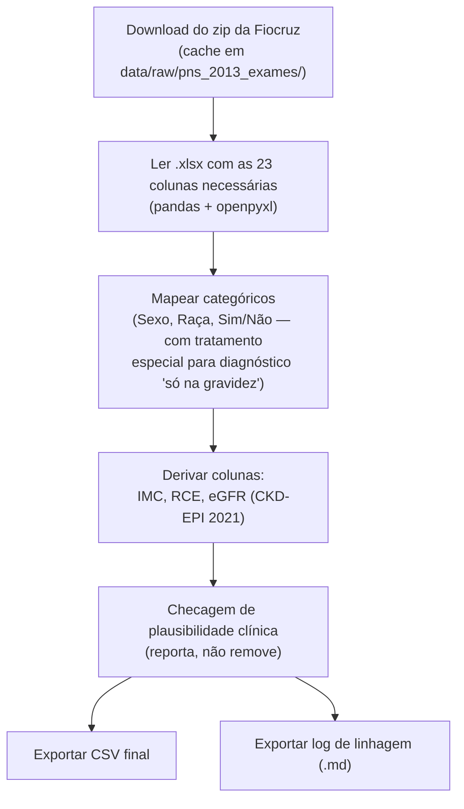

# SDD — Pipeline de Dados PNS 2013 para Síndrome Cardiorrenal-Metabólica (CKM) + RCE

| | |
|---|---|
| **Projeto** | CardioIA — Fase 1 (Batimentos de Dados) |
| **Componente** | `src/build_pns_ckm_dataset.py` |
| **Cache de dados brutos** | `data/raw/pns_2013_exames/` (não versionado) |
| **Dataset gerado** | `data/processed/pns_ckm_rce_2013.csv` |
| **Log de linhagem** | `data/processed/pns_ckm_rce_2013_LINHAGEM.md` (gerado a cada execução) |
| **Status** | Implementado e validado |
| **Última revisão** | 2026-08-31 |

---

## 1. Objetivo

Construir, a partir de dados públicos e reais de população **brasileira**, um dataset numérico único que permita:

1. Calcular a **RCE (Relação Cintura-Estatura / Waist-to-Height Ratio)** por participante;
2. Cobrir os três eixos da **Síndrome Cardiovascular-Renal-Metabólica (CKM)** — metabólico, renal e cardiovascular — na mesma linha de dado;
3. Servir de base numérica (Parte 1) do projeto CardioIA, com desfechos rotulados para uso futuro em classificadores.

## 2. Por que PNS 2013 (contexto de decisão)

A base numérica do CardioIA precisa representar a população que o sistema pretende atender — o ecossistema de saúde brasileiro/SUS. Isso exige uma pesquisa de saúde **brasileira**, com dado individual real e com os biomarcadores necessários para os 3 eixos da Síndrome CKM (não só entrevista). Avaliamos as 3 edições da Pesquisa Nacional de Saúde (PNS, IBGE/Ministério da Saúde):

| Edição | Tem exame de sangue/urina? | Veredito |
|---|---|---|
| **PNS 2019** (2ª edição, mais recente já publicada) | ❌ Não — só entrevista + antropometria (módulo W) | Descartada: sem creatinina/HbA1c/colesterol não dá para calcular eGFR nem cobrir os pilares renal/metabólico |
| **PNS 2026** (3ª edição, em coleta desde jul/2026) | ✅ Vai ter, pela 1ª vez como parte do desenho principal | Descartada por ora: coleta só termina em nov/2026, microdado não deve sair antes de 2027 |
| **PNS 2013** (1ª edição) + módulo de exames laboratoriais (coleta domiciliar 2014-2015, Fiocruz/ICICT) | ✅ Sim | **Escolhida** — única com biomarcadores reais publicados e disponíveis hoje |

Ou seja: a edição mais recente (2019) não tem os números que o projeto precisa; a próxima com exames (2026) ainda não existe como microdado. A PNS 2013 é a única opção viável agora que resolve o viés de população mantendo os 3 eixos da CKM.

## 3. Fonte de dados

A **Fiocruz/ICICT já disponibiliza um único arquivo Excel** com o questionário principal da PNS 2013 e os exames laboratoriais (coleta 2014-2015) cruzados por pessoa — não é necessário baixar e fundir múltiplos arquivos por fonte:

- **Arquivo**: `EXAMES-PNS-2013-FINAL_05052023.xlsx`, dentro de `PNS2013_Exames.zip`
- **URL**: `https://www.pns.icict.fiocruz.br/wp-content/uploads/2023/05/PNS2013_Exames.zip`
- **Dicionário**: `dicionario_de_variaveis_exames_pns_2013_05052023.xlsx` (mesmo zip)
- **Amostra**: 8.952 pessoas de 18+ anos, subamostra de 25% dos setores censitários da PNS 2013, com peso amostral próprio (`peso_lab`)
- **Publicado por**: Fundação Oswaldo Cruz (Fiocruz/ICICT), em parceria com IBGE/Ministério da Saúde

## 4. Arquitetura do pipeline



Execução: `python src/build_pns_ckm_dataset.py` (dependências: `pandas`, `openpyxl`, ver `requirements.txt`).

**Não há junção de múltiplas tabelas** neste pipeline — a Fiocruz já entrega um arquivo único por pessoa, o que elimina toda a categoria de risco de "merge multiplicando linhas". A fidelidade aqui se concentra em (a) mapear corretamente os códigos de cada variável contra o dicionário oficial e (b) distinguir pergunta condicional (skip pattern) de dado realmente perdido.

## 5. Estratégia de garantia de fidelidade

### 5.1 Verificação de códigos categóricos contra o dicionário oficial
Cada variável categórica foi conferida linha a linha no dicionário `dicionario_de_variaveis_exames_pns_2013_05052023.xlsx` antes de mapear, não assumida por convenção. Achado relevante: `Q002` (hipertensão) e `Q030` (diabetes) têm uma **3ª categoria** ("diagnóstico só durante a gravidez", código 2) além de Sim (1) e Não (3) — diferente do padrão Sim/Não simples das demais perguntas (`Q060`, `Q06301-03`, `Q068`, `N005`, código 1=Sim/2=Não). Ignorar essa 3ª categoria e tratar "2" como "Não" inflacionaria artificialmente os diagnósticos crônicos; o pipeline mapeia o código 2 para `NaN` nessas duas colunas.

### 5.2 Tipo de dado após leitura via pandas
As colunas de diagnóstico chegam no arquivo de origem como texto (`"1"`, `"2"`, `"3"`), mas o `pandas.read_excel` as converte para `float64` (1.0/2.0/3.0) por causa dos valores ausentes. O pipeline mapeia usando chaves numéricas, não string — um erro comum nessa conversão (chave string contra coluna float) faria `.map()` retornar 100% `NaN` silenciosamente; isso foi detectado e corrigido durante o desenvolvimento (ver histórico de revisões).

### 5.3 Ausência de dado ≠ dado perdido — perguntas condicionais
`Insuficiencia_Cardiaca` (Q06303), `Doenca_Coronariana` (Q06302) e `Infarto_Miocardio` (Q06301) têm ~95,5% de valores ausentes — **não é dado perdido**: essas 3 perguntas só são feitas a quem respondeu "Sim" à pergunta guarda-chuva Q063 ("algum médico já lhe deu diagnóstico de doença do coração"). Quem nunca teve diagnóstico de doença do coração corretamente não recebe essas perguntas de detalhamento.

### 5.4 eGFR recalculado, não usado o valor pré-computado da PNS
A PNS já entrega um eGFR pré-calculado (`Z026`/`Z027`), mas pela fórmula **CKD-EPI 2009**, que usa um coeficiente de raça (duas colunas separadas: "afrodescendente" e "não afrodescendente"). O pipeline **recalcula o eGFR a partir da creatinina bruta (`Z025`) usando CKD-EPI 2021** (Inker et al., NEJM 2021, sem coeficiente de raça) — o padrão clínico atual — em vez do valor de 2009 já embutido no arquivo de origem.

### 5.5 Checagem de plausibilidade (reporta, não decide sozinha)
| Coluna | Faixa aceita | Fora da faixa (execução de referência) |
|---|---|---|
| RCE | [0,25 – 1,3] | 0 |
| IMC | [10 – 80] | 0 |
| eGFR_CKD_EPI_2021 | [0 – 200] | 0 |
| PA_Sistolica_mmHg | [60 – 260] | 0 |
| PA_Diastolica_mmHg | [30 – 160] | 0 |

Nenhum valor fora de faixa na execução de referência.

## 6. Dicionário de dados (arquivo final)

| Coluna | Origem (código PNS) | Unidade | Observação |
|---|---|---|---|
| `ID_Participante` | — | — | **índice sequencial sintético** (1..8952) — o arquivo de exames não traz a chave de pessoa do PNS principal (Fiocruz remove essa ligação nesta versão); não é um código oficial do IBGE |
| `Idade` | `C008` | anos | igual ao valor da base do IBGE, conferido contra `Z002` |
| `Sexo` | `Z001` | M/F | mapeado de 1/2 |
| `Raca_Etnia` | `Z003` | categórico | 5 categorias + Ignorado (9→NaN) |
| `Regiao` | `regiao` | categórico | região do Brasil |
| `Peso_kg` / `Altura_cm` | `z004` / `z005` | kg / cm | **medidos** por técnico (balança/estadiômetro), não autorreferidos |
| `Circunferencia_Cintura_cm` | `W00303` | cm | medição final (média de 2 leituras), técnico treinado |
| `IMC` | derivado: `Peso_kg / (Altura_cm/100)²` | kg/m² | a PNS não traz IMC pré-calculado |
| `RCE` | derivado: `Circunferencia_Cintura_cm / Altura_cm` | adimensional | referência clínica ~0,5 |
| `PA_Sistolica_mmHg` / `PA_Diastolica_mmHg` | `W00407` / `W00408` | mmHg | valor final (média de até 3 leituras), medição por aparelho |
| `Colesterol_Total_mgdL` / `HDL_mgdL` / `LDL_mgdL` | `Z031` / `Z032` / `Z033` | mg/dL | inclui LDL, ampliando a cobertura do pilar metabólico |
| `HbA1c_pct` | `Z034` | % | |
| `Creatinina_Serica_mgdL` | `Z025` | mg/dL | |
| `eGFR_CKD_EPI_2021` | derivado (CKD-EPI 2021 sem raça, a partir de `Z025`+idade+sexo) | mL/min/1,73m² | ver §5.4 — não é o `Z026`/`Z027` da PNS |
| `Diabetes_Diagnosticado` | `Q030` | Sim/Nao | código 2 ("só na gravidez") → NaN, ver §5.1 |
| `Hipertensao_Diagnosticada` | `Q002` | Sim/Nao | idem |
| `Colesterol_Alto_Diagnosticado` | `Q060` | Sim/Nao | variável adicional ao dicionário original do projeto |
| `Insuficiencia_Cardiaca` | `Q06303` | Sim/Nao | só perguntado a quem respondeu Sim a Q063 (ver §5.3) |
| `Doenca_Coronariana` | `Q06302` (angina) | Sim/Nao | aproximação — a PNS não pergunta "doença coronariana" com esse rótulo; angina é a apresentação clínica mais próxima desse conceito diagnóstico |
| `Infarto_Miocardio` | `Q06301` | Sim/Nao | idem restrição de §5.3 |
| `AVC` | `Q068` | Sim/Nao | |
| `Sintoma_Dor_Desconforto_Peito` | `N005` | Sim/Nao | item do Rose Angina Questionnaire (dor ao caminhar em ritmo normal, terreno plano) — protocolo validado e amplamente usado em epidemiologia cardiovascular |
| `Peso_Amostral` | `peso_lab` | — | peso amostral da subamostra de exames; não aplicado neste CSV bruto (ver §7) |

## 7. Limitações conhecidas (residuais, não resolvidas pelo pipeline)

- **Sem albuminúria / relação albumina-creatinina urinária.** A coleta de urina da PNS mede sódio, potássio e creatinina (para estimar ingestão de sal), não albumina. O pilar renal fica restrito a creatinina + eGFR, sem marcador de dano renal precoce por albuminúria.
- **Sem glicemia direta.** A PNS não fez teste de glicose no sangue — só existe uma "glicose média estimada" (`Z035`), matematicamente derivada do HbA1c pela fórmula ADAG (eAG = 28,7 × HbA1c − 46,7). Por ser 100% redundante com `HbA1c_pct` (mesma informação, sem medição independente), essa coluna foi **deliberadamente excluída** do CSV final para não sugerir um segundo sinal metabólico onde só existe um.
- **Sem sintoma de dispneia.** Não há pergunta sobre falta de ar ao esforço no questionário da PNS — sem substituto disponível.
- **Sem frequência cardíaca / pulso.** A PNS não mede pulso na etapa antropométrica.
- **Dado de 2014-2015.** É o preço de ser a única edição da PNS com exames laboratoriais publicados até o momento (ver §2).
- **Pesos amostrais não aplicados.** `Peso_Amostral` (`peso_lab`) está disponível na base, mas não foi aplicado neste CSV bruto — estatísticas descritivas simples não são diretamente representativas da população brasileira sem esse ajuste.
- **Dado autorreferido nos desfechos.** `Insuficiencia_Cardiaca`, `Infarto_Miocardio`, `Doenca_Coronariana`, `AVC`, `Diabetes_Diagnosticado`, `Hipertensao_Diagnosticada` e `Colesterol_Alto_Diagnosticado` vêm de "um médico já lhe deu o diagnóstico de...", não de diagnóstico verificado em prontuário — é a limitação padrão de qualquer questionário de saúde.
- **ID sintético.** `ID_Participante` é apenas um índice de linha, não uma chave oficial do IBGE (ver §6) — não permite religar esta base a outras publicações da PNS 2013 em nível de pessoa.

## 8. Governança, privacidade e redistribuição

- Microdados desidentificados do IBGE (parceria com Ministério da Saúde/Fiocruz), sob a **Lei de Acesso à Informação (Lei nº 12.527/2011)** e a política de Dados Abertos do IBGE — download livre, sem cadastro ou autorização prévia, para pesquisa/educação.
- Não encontramos uma declaração de licença específica (tipo "CC0"/"CC-BY") na página da Fiocruz para este arquivo — a base legal usada aqui é o arcabouço geral de dados abertos do governo brasileiro. Recomenda-se reconfirmar isso antes de qualquer uso fora do contexto educacional deste projeto.
- Sem qualquer dado pessoal identificável (PII): sem nome, endereço, ou código de pessoa que permita religar ao PNS principal.
- Recomenda-se citar a fonte oficial no README: *"Pesquisa Nacional de Saúde (PNS) 2013 — módulo de exames laboratoriais (coleta 2014-2015), IBGE/Ministério da Saúde, dados disponibilizados pela Fundação Oswaldo Cruz (Fiocruz/ICICT)"*.

## 9. Como reproduzir

```bash
pip install -r requirements.txt
python src/build_pns_ckm_dataset.py
```

Saídas: `data/processed/pns_ckm_rce_2013.csv` (dataset, 8.952 linhas) e `data/processed/pns_ckm_rce_2013_LINHAGEM.md` (log de linhagem gerado automaticamente a cada execução). O zip original fica cacheado em `data/raw/pns_2013_exames/` (não versionado — recriado a cada checkout limpo).

Este CSV é a Camada 1 (dado bruto processado). A classificação clínica em estágios CKM (Camadas 2-4) é derivada separadamente por [`src/derive_ckm_stage.py`](../src/derive_ckm_stage.py), documentado em [`especificacao-estagios-ckm.md`](especificacao-estagios-ckm.md), e não faz parte deste pipeline de extração.

## 10. Histórico de revisões

| Data | Mudança |
|---|---|
| 2026-08-31 | Versão inicial: pipeline PNS 2013 + módulo de exames laboratoriais (Fiocruz/ICICT), construído para fornecer dados numéricos de população brasileira. eGFR recalculado com CKD-EPI 2021 (padrão clínico atual, sem coeficiente de raça). Bug de mapeamento categórico (chave string contra coluna float64) identificado e corrigido durante o desenvolvimento — ver §5.2. |
