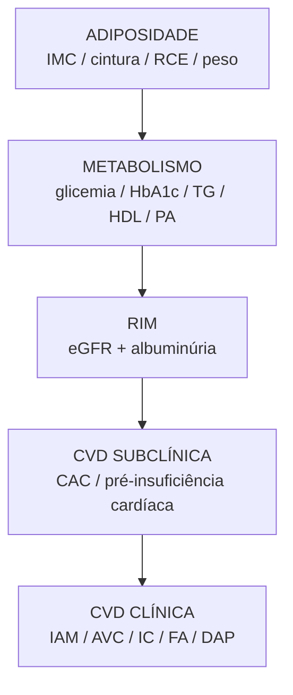

# Especificação — Estágios da Síndrome Cardiovascular-Renal-Metabólica (CKM)

| | |
|---|---|
| **Projeto** | CardioIA — Fase 1 (Batimentos de Dados) |
| **Escopo** | Mapeamento indicador → variável PNS 2013 → estágio CKM, antes da implementação de `CKM_stage` |
| **Base de dados** | `data/processed/pns_ckm_rce_2013.csv` (ver `.spec/SDD-pipeline-pns-ckm.md`) |
| **Status** | Especificação e implementação concluídas — [`src/derive_ckm_stage.py`](../src/derive_ckm_stage.py) (Camadas 2-4, Python) + [`src/calcular_prevent.R`](../src/calcular_prevent.R) (Estágio 3 via PREVENT, R) |
| **Última revisão** | 2026-09-01 |

---

## 1. Objetivo

Definir, **antes de escrever código de classificação**, quais indicadores a definição oficial de CKM exige em cada estágio, quais desses indicadores existem de fato na PNS 2013, e — pros que não existem — se dá pra aproximar, derivar, ou se o estágio fica simplesmente não-classificável com este dataset.

## 2. O mapa conceitual do CKM

A AHA define CKM como uma progressão: **adiposidade → alterações metabólicas/renais → doença cardiovascular subclínica → doença cardiovascular clínica**.



Nem todo indicador é medido diretamente — alguns são **brutos**, alguns **derivados** (fórmula), e alguns são **classificações** (categoria clínica a partir de um ou mais derivados).

## 3. Os 6 grupos de parâmetros e a matriz de disponibilidade na PNS 2013

Verificado diretamente no dicionário oficial (`dicionario_de_variaveis_exames_pns_2013_05052023.xlsx` e `input_PNS_2013.txt`) — não por suposição. Legenda: 🟢 disponível diretamente · 🟡 calculável/derivável · 🔴 não disponível.

### A. Adiposidade

| Indicador | Status | Variável PNS | Nota |
|---|---|---|---|
| Peso | 🟢 | `z004` | medido por técnico |
| Altura | 🟢 | `z005` | medido |
| Cintura | 🟢 | `W00303` | medida, média de 2 leituras |
| Quadril | 🔴 | — | **confirmado ausente** — a única ocorrência de "quadril" no dicionário é sobre fratura por queda (K55), não medida antropométrica |
| IMC | 🟡 | derivado | `Peso_kg / (Altura_cm/100)²` — já implementado no pipeline |
| RCE / WHtR | 🟡 | derivado | `Circunferencia_Cintura_cm / Altura_cm` — já implementado |
| RCQ | 🔴 | — | impossível — depende do quadril |

### B. Metabolismo / glicemia

| Indicador | Status | Variável PNS | Nota |
|---|---|---|---|
| Glicemia de jejum | 🔴 | — | não coletada; existe só "glicose média estimada" (`Z035`), 100% derivada do HbA1c pela fórmula ADAG — **já excluída do pipeline** por ser redundante (ver SDD §7) |
| HbA1c | 🟢 | `Z034` | |
| Diabetes (diagnóstico) | 🟢 | `Q030` | autorreferido; código "2 = só na gravidez" mapeado pra NaN (SDD §5.1) |
| Pré-diabetes (diagnóstico) | 🔴 | — | não é perguntado como diagnóstico — só dá pra **derivar** pela faixa de HbA1c (5,7–6,4%) |
| Uso de antidiabético | 🟡 | `Q03401`/`Q03402` | proxy — pergunta é sobre uso "nas últimas 2 semanas", não "em tratamento contínuo" |

### C. Perfil lipídico

| Indicador | Status | Variável PNS | Nota |
|---|---|---|---|
| Triglicerídeos | 🔴 | — | **confirmado ausente** — busca no dicionário completo não encontrou nenhuma variável de triglicerídeos |
| HDL | 🟢 | `Z032` | |
| LDL | 🟢 | `Z033` | método direto — não depende de triglicerídeos (diferente da fórmula de Friedewald) |
| Colesterol total | 🟢 | `Z031` | |
| Colesterol alto (diagnóstico) | 🟢 | `Q060` | variável extra, sem equivalente no dicionário de dados original do projeto |

### D. Pressão arterial

| Indicador | Status | Variável PNS | Nota |
|---|---|---|---|
| PA sistólica / diastólica | 🟢 | `W00407` / `W00408` | medida por aparelho, 3 leituras + valor final |
| Hipertensão (diagnóstico) | 🟢 | `Q002` | mesma ressalva do código "só na gravidez" |
| Uso de anti-hipertensivo | 🟡 | `Q006` | mesmo proxy "últimas 2 semanas" |

### E. Rim

| Indicador | Status | Variável PNS | Nota |
|---|---|---|---|
| Creatinina sérica | 🟢 | `Z025` | |
| eGFR | 🟡 | derivado | recalculado com CKD-EPI 2021 sem raça (SDD §5.4) — a PNS entrega um valor pronto (`Z026`/`Z027`), mas pela fórmula 2009 com coeficiente de raça, não usada aqui |
| Albumina urinária | 🔴 | — | **confirmado ausente** — a coleta de urina mede só sódio, potássio e creatinina (pra estimar ingestão de sal, não dano renal) |
| Creatinina urinária | 🟢 | `Z048` | existe isolada, mas sem o par (albumina) não serve pra UACR |
| UACR (albumina/creatinina urinária) | 🔴 | — | impossível — falta o numerador |
| Categoria KDIGO G (por eGFR) | 🟡 | derivado | calculável a partir do eGFR já calculado |
| Categoria KDIGO A (por UACR) | 🔴 | — | impossível sem UACR |
| Risco CKD-KDIGO combinado (matriz G×A) | 🔴 | — | impossível — só temos uma das duas dimensões |

### F. CVD clínica (estágio 4)

| Indicador | Status | Variável PNS | Nota |
|---|---|---|---|
| IAM / infarto | 🟢 | `Q06301` | |
| AVC | 🟢 | `Q068` | |
| Insuficiência cardíaca | 🟢 | `Q06303` | |
| Doença coronariana | 🟢 (aproximação) | `Q06302` (angina) | a PNS não pergunta "doença coronariana" com esse rótulo — angina é a apresentação clínica mais próxima (SDD §6) |
| Fibrilação atrial | 🔴 | — | **confirmado ausente** — nenhuma pergunta sobre arritmia/fibrilação no dicionário |
| Doença arterial periférica | 🔴 | — | não perguntado (nenhuma questão sobre claudicação) |

### G. CVD subclínica (estágio 3)

| Indicador | Status | Variável PNS | Nota |
|---|---|---|---|
| CAC (escore de cálcio coronário) | 🔴 | — | exige tomografia — inviável em pesquisa domiciliar |
| NT-proBNP | 🔴 | — | **confirmado ausente** no painel de exames laboratoriais |
| Troponina (hs-cTnT/hs-cTnI) | 🔴 | — | idem |
| Ecocardiograma | 🔴 | — | exige exame de imagem, fora do desenho da pesquisa |
| Risco PREVENT-CVD (10 anos) | 🟡 | calculável (proxy) | os insumos existem (idade, sexo, PA, colesterol, diabetes, eGFR) — mas é uma extensão a validar cientificamente, não um dado bruto nem um critério oficial de estágio 3 |

## 4. Viabilidade por estágio

| Estágio CKM | Viabilidade com PNS 2013 | Detalhe |
|---|---|---|
| **0/1** (sem risco / adiposidade e metabolismo alterado) | ✅ Totalmente viável | IMC, RCE, HbA1c cobrem os critérios |
| **2** (fatores de risco metabólico/renal) | ⚠️ Parcial | Hipertensão/diabetes/colesterol/eGFR(G) ok. **Síndrome metabólica fica com só 4 dos 5 critérios** (sem triglicerídeos). **DRC fica só com a dimensão G**, sem a A (sem albuminúria) |
| **3** (CVD subclínica) | ❌ **Não classificável com dado bruto** | CAC, NT-proBNP, troponina e ecocardiograma — todos ausentes. Only saída é o escore PREVENT como proxy (ver §5) |
| **4** (CVD clínica) | ✅ Quase completo | Falta só fibrilação atrial e doença arterial periférica; infarto/AVC/IC/coronariana(aprox.) cobertos |

**O Estágio 3 é o buraco real do mapa** — ausência total dos 4 indicadores que a diretriz aceita como evidência de doença cardiovascular subclínica.

## 5. Decisão de projeto: como tratar o Estágio 3

Três opções foram consideradas:

| Opção | Descrição | Risco |
|---|---|---|
| (a) Colapsar 2+3 | Juntar estágio 2 e 3 numa faixa só quando não há evidência subclínica | Esconde a diferença clínica entre os dois estágios |
| (b) **Marcar como indeterminado** | Criar uma categoria explícita `Estagio_3_Nao_Avaliavel` em vez de decidir por padrão | Mais honesto, mas não gera um rótulo pronto pra classificador supervisionado sem tratamento extra |
| (c) Usar PREVENT-CVD como proxy | Calcular o escore de risco e usar ≥20% como equivalente de estágio 3, conforme a própria diretriz aceita | Depende de validar o cálculo do PREVENT com o que temos; é aproximação, não o critério oficial (CAC/NT-proBNP) |

**Recomendação:** adotar (b) como padrão — nunca classificar alguém como "não é estágio 3" só porque falta o dado; marcar como indeterminado, seguindo o mesmo princípio de "reportar, não decidir silenciosamente" já usado no resto do projeto — e oferecer (c) como uma coluna extra/experimental, claramente rotulada como proxy, para quem quiser usar mesmo assim.

## 6. Arquitetura em camadas (adaptada à disponibilidade real)

```
Camada 1 — Dados brutos (já no CSV)
  Idade, Sexo, Raca_Etnia, Regiao, Peso_kg, Altura_cm, Circunferencia_Cintura_cm,
  PA_Sistolica_mmHg, PA_Diastolica_mmHg, HbA1c_pct, Colesterol_Total_mgdL, HDL_mgdL,
  LDL_mgdL, Creatinina_Serica_mgdL, Diabetes_Diagnosticado, Hipertensao_Diagnosticada,
  Colesterol_Alto_Diagnosticado, Insuficiencia_Cardiaca, Doenca_Coronariana,
  Infarto_Miocardio, AVC, Sintoma_Dor_Desconforto_Peito
        ↓
Camada 2 — Indicadores calculados (IMC/RCE no pipeline; Categoria_KDIGO_G no script de derivação)
  IMC, RCE, eGFR_CKD_EPI_2021 → Categoria_KDIGO_G
        ↓
Camada 3 — Classificadores (src/derive_ckm_stage.py)
  Obesidade, Obesidade_Central, Classificacao_Glicemica (Normal/Pre_Diabetes/Diabetes),
  Hipertensao_CKM, Dislipidemia, Sindrome_Metabolica_Parcial (3 de 4 critérios, sem TG)
        ↓
Camada 4 — Estágio CKM (src/derive_ckm_stage.py)
  CKM_Stage ∈ {0, 1, 2, 4, NaN} — ver §5, estágio 3 não é atribuível com esta base
```

Camadas ausentes por falta de dado bruto, **não implementáveis** com esta base: RCQ, UACR, categoria_KDIGO_A, risco_CKD_KDIGO combinado, estágio 3 por critério oficial. Escore PREVENT-CVD não implementado — decisão adiada (ver §8).

**Saída:** `data/processed/pns_ckm_estagios_2013.csv` (8.952 linhas, todas as colunas da Camada 1 + Camadas 2-4). Distribuição de referência: Estágio 0 = 15,2%, 1 = 25,3%, 2 = 55,1%, 4 = 4,4% — nenhuma pessoa ficou sem classificação por falta total de dado.

## 6.1 Validação externa: comparação com estudos publicados (NHANES)

Existem análises de estágio CKM publicadas usando NHANES (EUA). Comparar contra elas serve de validação externa — se a distribuição do PNS ficar muito fora da faixa observada nos EUA, é sinal de possível erro na implementação; se ficar próxima, é evidência de que a lógica está correta.

| Estágio | NHANES 1999-2018¹ | NHANES 2011-2020² | **PNS 2013 (este projeto)** |
|---|---|---|---|
| 0 | 13,2% | — | **15,2%** |
| 1 | 20,8% | 25,9% | **25,3%** |
| 2 | 53,1% | 49,0% | **55,1%** |
| 3 | 5,0% | 5,4% | **0% (indetectável, ver §5)** |
| 4 | 7,8% | 9,2% | **4,4%** |

**Leitura:** Estágios 0, 1 e 2 ficaram muito próximos dos números publicados para os EUA — evidência de que a hierarquia está implementada corretamente. Duas diferenças esperadas e explicáveis:
- **Estágio 2 um pouco mais alto no PNS** (55,1% vs. 49-53%): coerente com a limitação já documentada — quem "deveria" ser Estágio 3 fica retido no Estágio 2 aqui, por não conseguirmos detectar doença cardiovascular subclínica.
- **Estágio 4 mais baixo no PNS** (4,4% vs. 7,8-9,2%): não totalmente explicado. Hipóteses a investigar: população brasileira mais jovem na amostra, menor taxa de diagnóstico prévio (sub-registro por menor acesso à saúde), ou a aproximação de "doença coronariana" via angina (§6) perdendo casos que os critérios americanos capturariam.

¹ ² Números obtidos via resumo de busca (não lidos na íntegra) de dois estudos distintos que analisaram NHANES em janelas diferentes (1999-2018 e 2011-2020) — ver URLs em §7. **Autoria não confirmada nesta revisão; conferir os papers originais antes de citar em qualquer entrega formal.**

## 6.2 Estágio 3 real, via escore PREVENT

[`src/calcular_prevent.R`](../src/calcular_prevent.R) resolve a lacuna do Estágio 3 (§5) usando um dos critérios oficiais da própria diretriz: **risco PREVENT de 10 anos ≥ 20%** é aceito como equivalente de CVD subclínica quando não há CAC/NT-proBNP/troponina/ecocardiograma disponíveis.

**Por que em R:** o pacote `CVrisk` (`ascvd_10y_prevent()`) implementa a fórmula PREVENT com os coeficientes oficiais já publicados e validados por terceiros — evita transcrever à mão os coeficientes de um paper pago (Circulation, Khan et al. 2024), risco real de erro de transcrição. O restante do pipeline (extração + Camadas 2-4) permanece em Python, já testado — não foi reescrito.

**2 variáveis novas extraídas direto do Excel bruto** (não estavam no CSV da Camada 1):
- `Fumante_Atual` (`P050`) — 1.294 Sim, 7.650 Não, 8 NA
- `Uso_Anti_Hipertensivo` (`Q006`) — mesma ausência lógica já vista em outras colunas: só é perguntado a quem tem hipertensão diagnosticada. Os 6.423 `NA` de quem não tem o diagnóstico foram recodificados para `"Nao"` (mesmo princípio de `Insuficiencia_Cardiaca`/`Doenca_Coronariana`/`Infarto_Miocardio`, ver `.spec/SDD-pipeline-pns-ckm.md` §5.3)
- Uso de estatina: **não existe pergunta equivalente na PNS** — assumido `0` (não usa) para todos. Isso faz o risco calculado ser um **teto**, não uma média: quem realmente usa estatina tem o LDL/colesterol já controlado pelo medicamento, então a fórmula (que não sabe disso) tende a **superestimar** o risco dessas pessoas.

**Cobertura:** o escore só é calculado para 30-79 anos (faixa validada do PREVENT) com as 11 variáveis completas — **5.128 de 8.952 pessoas (57,3%)**. O resto fica de fora principalmente por idade (a PNS cobre 18-101 anos, bem além da faixa do PREVENT), não por falha de extração.

**Resultado (`CKM_Stage_Com_PREVENT`, coluna nova em `pns_ckm_prevent_2013.csv`):**

| Estágio | Sem PREVENT (`CKM_Stage`) | Com PREVENT (`CKM_Stage_Com_PREVENT`) |
|---|---|---|
| 0 | 15,2% | 15,2% |
| 1 | 25,3% | 25,3% |
| 2 | 55,1% | 54,9% |
| 3 | 0% (indetectável) | **0,2% (15 pessoas)** |
| 4 | 4,4% | 4,4% |

15 pessoas migraram do Estágio 2 pro Estágio 3 real. É um número pequeno — esperado, já que o critério de 20% de risco em 10 anos é bem exigente, e a maior parte da amostra nem entra na faixa etária avaliável. Ainda assim, é a diferença entre "Estágio 3 impossível de existir nesta base" e "Estágio 3 existe, mas é raro e conservador (por causa da suposição de estatina=0)".

## 6.3 Validação de fidelidade de `CKM_Stage`

[`tests/validar_ckm_stage.py`](../tests/validar_ckm_stage.py) prova, em vez de assumir, que a classificação é consequência lógica fiel dos dados — no mesmo espírito do `tests/validar_extracao_pns.py` que já valida a Camada 1. Duas partes:

- **Parte A:** recalcula os 6 classificadores da Camada 3 (`Obesidade`, `Obesidade_Central`, `Classificacao_Glicemica`, `Hipertensao_CKM`, `Sindrome_Metabolica_Parcial`, `Categoria_KDIGO_G`) do zero, com uma reimplementação independente dos limiares — não reaproveita nenhuma linha de código de `derive_ckm_stage.py`.
- **Parte B/C:** verifica que `CKM_Stage` e `CKM_Stage_Com_PREVENT` batem exatamente com a hierarquia esperada a partir desses classificadores, em todas as 8.952 linhas, nos dois sentidos (quem deveria estar em cada estágio está, e ninguém está lá sem cumprir o critério).

**Achado no processo (não é bug, é uma pegadinha de ponto flutuante a documentar):** a primeira execução acusou 1 divergência em `Obesidade`. Causa: uma pessoa com `Peso_kg=76,8` e `Altura_cm=160` tem IMC matematicamente igual a 30, mas `76.8 / (160/100)**2` em ponto flutuante dá `29.999999999999993` — abaixo de 30, então o pipeline (que usa esse valor em memória) corretamente calculou `Nao`. O `pandas.to_csv()` serializa esse número como texto `"30.0"` ao salvar; ao reler o CSV e comparar `IMC >= 30` usando o valor já arredondado, o teste inicialmente encontrava `Sim` — uma divergência falsa, causada pela perda de precisão do round-trip pelo CSV, não por erro de lógica. **Corrigido recalculando IMC e RCE a partir de `Peso_kg`/`Altura_cm`/`Circunferencia_Cintura_cm` brutos, nunca lendo as colunas `IMC`/`RCE` já salvas** — mesma disciplina que `tests/validar_extracao_pns.py` já usava. Lição para qualquer análise futura que reutilize este CSV: cuidado ao comparar `IMC`/`RCE` contra um limiar exato usando o valor já salvo em texto.

Resultado após a correção: **todas as 8.952 linhas passam nas 3 partes**, sem exceção.

## 6.4 Limitação de interpretação: critério clínico atendido ≠ diagnóstico confirmado

`CKM_Stage` **não é uma probabilidade** ("X% de chance de ter CKM") — é determinístico: aplica o limiar oficial (`HbA1c ≥ 6,5%` etc.) direto no valor medido, sem estimativa estatística envolvida (a única exceção genuína é `Risco_PREVENT_10anos_pct`, que é de fato uma probabilidade, vinda de um modelo validado). Mas também **não é o mesmo que um diagnóstico clínico confirmado**. A leitura correta de `CKM_Stage` é: *"os valores medidos desta pessoa, neste corte transversal único (a PNS não é longitudinal), atendem ao critério oficial do Estágio X"* — não *"esta pessoa tem/provavelmente tem a doença"*. É a mesma limitação que os próprios papers de NHANES citados na §6.1 assumem: eles reportam **prevalência estimada por critério de rastreio**, nunca "diagnóstico confirmado".

Motivos concretos, específicos desta base:

1. **Medição única vs. protocolo diagnóstico completo.** `HbA1c ≥ 6,5%` é um dos critérios da ADA para diabetes, mas o protocolo clínico completo pede duas medições anormais (ou uma + sintomas). A PNS fez uma coleta só, num único momento — um valor alterado por acaso naquele dia classifica a pessoa como `Diabetes` aqui, mesmo que uma segunda medição pudesse dar diferente.
2. **Medição pontual vs. definição de cronicidade.** O próprio KDIGO define Doença Renal Crônica como alteração de função renal **persistente por ≥3 meses**. Uma única creatinina baixa/eGFR baixo (por desidratação, por exemplo) pode classificar a pessoa em uma categoria KDIGO-G mais grave sem que a condição seja, de fato, crônica.
3. **Desfechos do Estágio 4 são autorreferidos.** "Um médico já lhe disse que..." está sujeito a viés de memória, sub-diagnóstico (quem tem menos acesso à saúde nunca chega a ser diagnosticado) e sobre-relato — já documentado como limitação padrão em `.spec/SDD-pipeline-pns-ckm.md` §7, mas vale reforçar aqui porque afeta diretamente a leitura do estágio mais grave da hierarquia.

**Implicação prática:** ao comunicar resultados deste dataset (relatório, gráfico, apresentação), preferir linguagem como *"X% da amostra apresentou valores compatíveis com o critério de Estágio 2"* em vez de *"X% da amostra tem CKM Estágio 2"* — a segunda frase sugere uma certeza diagnóstica que o desenho de uma pesquisa transversal única não sustenta.

## 7. Fontes usadas

- [2026 AHA/ACC/ADA/ASN Guideline for CKM Syndrome (AHA Professional Heart Daily)](https://professional.heart.org/en/science-news/2026-guideline-for-the-prevention-detection-evaluation-and-management-of-ckm-syndrome) e [JACC](https://www.jacc.org/doi/10.1016/j.jacc.2026.05.008) — classificação de estágios atual (fonte principal), publicada 9/jun/2026. Confirmado: Estágio 1 inclui pré-diabetes ("dysfunctional adipose tissue... reflected by prediabetes"), consistente com a implementação em `src/derive_ckm_stage.py`
- AHA Presidential Advisory 2023 — conceito e estrutura original do CKM
- KDIGO 2024 — classificação renal por eGFR (categoria G) e albuminúria (categoria A)
- [Development and Validation of the AHA's PREVENT Equations (Circulation, Khan et al. 2024)](https://www.ahajournals.org/doi/10.1161/CIRCULATIONAHA.123.067626) — variáveis exigidas e estrutura da equação
- [Pacote R `CVrisk` (CRAN)](https://cran.r-project.org/web/packages/CVrisk/readme/README.html), motor `preventr` ([GitHub](https://github.com/martingmayer/preventr)) — implementação de terceiros dos coeficientes oficiais do PREVENT, usada em `src/calcular_prevent.R` em vez de transcrição manual
- [High Prevalence of CKM Syndrome Among US Adults 1999-2020 (medRxiv)](https://www.medrxiv.org/content/10.1101/2024.03.04.24303751v1.full) e [Gender/Age-related Disparities in CKM Prevalence (PMC)](https://www.ncbi.nlm.nih.gov/pmc/articles/PMC12874573/) — números usados na comparação da §6.1
- [Cardiovascular-Kidney-Metabolic Syndrome: A Current and Urgent Concept (Jornal Brasileiro de Nefrologia/SciELO, 2025)](https://doi.org/10.1590/2175-8239-JBN-2024-0277en), CC BY 4.0 — artigo brasileiro sobre a diretriz, também incluído como texto da Parte 2 (`assets/ckm_current_urgent_concept.txt`)
- Literatura sobre RCE/WHtR vs. IMC e risco cardiometabólico — linha bibliográfica separada do critério oficial de estágio, usada para justificar por que a RCE é calculada e investigada neste projeto (não é, por si só, um critério de estágio 1)

## 8. Próximos passos

1. ~~Implementar Camada 2/3~~ — feito em [`src/derive_ckm_stage.py`](../src/derive_ckm_stage.py).
2. ~~Implementar `CKM_Stage`~~ — feito, opção (b) da §5 adotada como padrão.
3. ~~Atualizar `.spec/SDD-pipeline-pns-ckm.md` com um link cruzado~~ — feito.
4. ~~Escore PREVENT-CVD (opção c da §5)~~ — **implementado** em [`src/calcular_prevent.R`](../src/calcular_prevent.R), usando o pacote R `CVrisk::ascvd_10y_prevent()` (coeficientes oficiais já validados por terceiros, evitando transcrever à mão de um paper pago). Ver §6.2.

## 9. Histórico de revisões

| Data | Mudança |
|---|---|
| 2026-08-31 | Documento criado a partir do mapeamento conceitual do CKM (AHA/ACC/ADA/ASN 2026, KDIGO 2024) cruzado com o dicionário oficial da PNS 2013. Confirmado no dicionário: ausência de quadril (antropométrico), triglicerídeos, albumina urinária, fibrilação atrial, DAP, CAC, NT-proBNP, troponina e ecocardiograma. Estágio 3 identificado como não-classificável com dado bruto disponível. |
| 2026-08-31 | Camadas 2-4 implementadas em `src/derive_ckm_stage.py`, separado do pipeline de extração. Saída: `data/processed/pns_ckm_estagios_2013.csv`. Validado: distribuição de estágios plausível (0=15,2%, 1=25,3%, 2=55,1%, 4=4,4%), nenhuma pessoa sem classificação por falta total de dado, categorias KDIGO-G somam exatamente os 417 ausentes de eGFR já conhecidos da EDA. |
| 2026-08-31 | Pesquisa aprofundada: confirmada a diretriz AHA/ACC/ADA/ASN 2026 (Estágio 1 inclui pré-diabetes, consistente com nossa implementação); comparação com estudos NHANES adicionada (§6.1) — Estágios 0/1/2 muito próximos dos EUA, validação externa da lógica; PREVENT reavaliado como mais viável (8 de 11 variáveis já disponíveis); artigo brasileiro CC BY 4.0 sobre CKM (JBN 2025) adicionado como 3º texto da Parte 2. |
| 2026-08-31 | Estágio 3 implementado de verdade via `src/calcular_prevent.R` (pacote `CVrisk`, critério oficial "PREVENT ≥ 20%"). Extraídas 2 colunas novas do Excel bruto (`Fumante_Atual`, `Uso_Anti_Hipertensivo`); corrigida ausência lógica em `Uso_Anti_Hipertensivo` (só perguntado a quem tem hipertensão diagnosticada), que dobrou a cobertura do escore de 16,4% para 57,3%. Resultado: 15 pessoas (0,2%) classificadas em Estágio 3 real, coluna `CKM_Stage_Com_PREVENT` em `data/processed/pns_ckm_prevent_2013.csv`. Uso de estatina assumido 0 para todos (não perguntado na PNS) — risco calculado é um teto, não uma média. |
| 2026-09-01 | Fidelidade de `CKM_Stage`/`CKM_Stage_Com_PREVENT` validada em `tests/validar_ckm_stage.py` (§6.3) — recálculo independente da Camada 3 + invariantes bidirecionais da hierarquia, todas as 8.952 linhas passam. Encontrada e corrigida no processo uma pegadinha de precisão de ponto flutuante no round-trip via CSV (`IMC`/`RCE` salvos podem arredondar para um valor exatamente no limiar quando o valor real em memória era levemente diferente) — documentada como cuidado pra qualquer reuso futuro do CSV. |
| 2026-09-01 | Adicionada §6.4: `CKM_Stage` documentado explicitamente como "atende ao critério clínico num corte transversal único", não probabilidade nem diagnóstico confirmado — 3 motivos concretos (medição única vs. protocolo diagnóstico completo, medição pontual vs. definição de cronicidade do KDIGO, desfechos de Estágio 4 autorreferidos). Nota equivalente adicionada ao docstring de `src/derive_ckm_stage.py`. |
